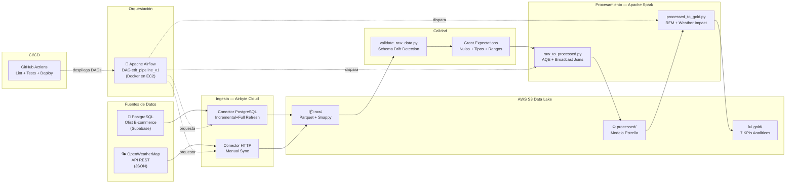
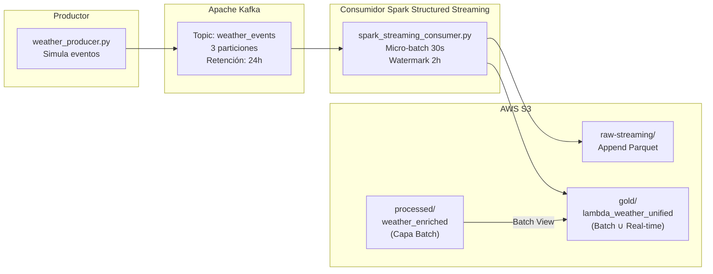
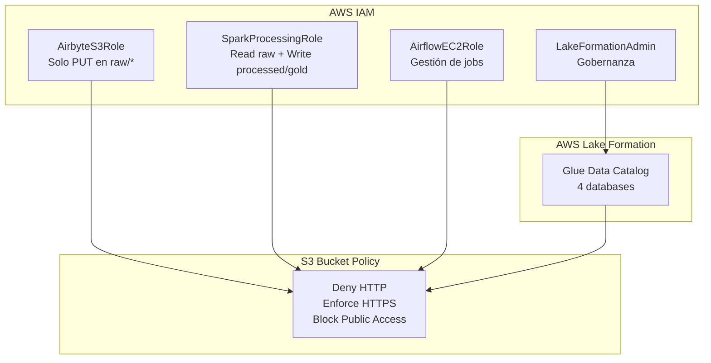

# Diagrama de Arquitectura del Pipeline ETLT — Proyecto Integrador M4

## Flujo Batch (ETLT)

```mermaid
graph LR
    subgraph "Fuentes de Datos"
        PG["🐘 PostgreSQL<br/>Olist E-commerce<br/>(Supabase)"]
        API["🌤️ OpenWeatherMap<br/>API REST<br/>(JSON)"]
    end

    subgraph "Ingesta — Airbyte Cloud"
        AB_PG["Conector PostgreSQL<br/>Incremental+Full Refresh"]
        AB_API["Conector HTTP<br/>Manual Sync"]
    end

    subgraph "AWS S3 Data Lake"
        RAW["📦 raw/<br/>Parquet + Snappy"]
        PROC["⚙️ processed/<br/>Modelo Estrella"]
        GOLD["📊 gold/<br/>7 KPIs Analíticos"]
    end

    subgraph "Procesamiento — Apache Spark"
        SP1["raw_to_processed.py<br/>AQE + Broadcast Joins"]
        SP2["processed_to_gold.py<br/>RFM + Weather Impact"]
    end

    subgraph "Orquestación"
        AF["🎼 Apache Airflow<br/>DAG etlt_pipeline_v1<br/>(Docker en EC2)"]
    end

    subgraph "Calidad"
        VAL["validate_raw_data.py<br/>Schema Drift Detection"]
        GE["Great Expectations<br/>Nulos + Tipos + Rangos"]
    end

    subgraph "CI/CD"
        GH["GitHub Actions<br/>Lint + Tests + Deploy"]
    end

    PG --> AB_PG
    API --> AB_API
    AB_PG --> RAW
    AB_API --> RAW
    RAW --> VAL --> GE --> SP1
    SP1 --> PROC --> SP2
    SP2 --> GOLD
    AF -.->|"orquesta"| AB_PG
    AF -.->|"orquesta"| AB_API
    AF -.->|"dispara"| SP1
    AF -.->|"dispara"| SP2
    GH -.->|"despliega DAGs"| AF
```

## Flujo Streaming (Arquitectura Lambda)

```mermaid
graph LR
    subgraph "Productor"
        PROD["weather_producer.py<br/>Simula eventos"]
    end

    subgraph "Apache Kafka"
        TOPIC["Topic: weather_events<br/>3 particiones<br/>Retención: 24h"]
    end

    subgraph "Consumidor Spark Structured Streaming"
        CONS["spark_streaming_consumer.py<br/>Micro-batch 30s<br/>Watermark 2h"]
    end

    subgraph "AWS S3"
        RS["raw-streaming/<br/>Append Parquet"]
        BATCH["processed/<br/>weather_enriched<br/>(Capa Batch)"]
        LAMBDA["gold/<br/>lambda_weather_unified<br/>(Batch ∪ Real-time)"]
    end

    PROD --> TOPIC --> CONS
    CONS --> RS
    CONS --> LAMBDA
    BATCH -->|"Batch View"| LAMBDA
```

## Gobernanza y Seguridad

```mermaid
graph TD
    subgraph "AWS IAM"
        R1["AirbyteS3Role<br/>Solo PUT en raw/*"]
        R2["SparkProcessingRole<br/>Read raw + Write processed/gold"]
        R3["AirflowEC2Role<br/>Gestión de jobs"]
        R4["LakeFormationAdmin<br/>Gobernanza"]
    end

    subgraph "AWS Lake Formation"
        LF["Glue Data Catalog<br/>4 databases"]
    end

    subgraph "S3 Bucket Policy"
        BP["Deny HTTP<br/>Enforce HTTPS<br/>Block Public Access"]
    end

    R1 --> BP
    R2 --> BP
    R3 --> BP
    R4 --> LF --> BP
```
